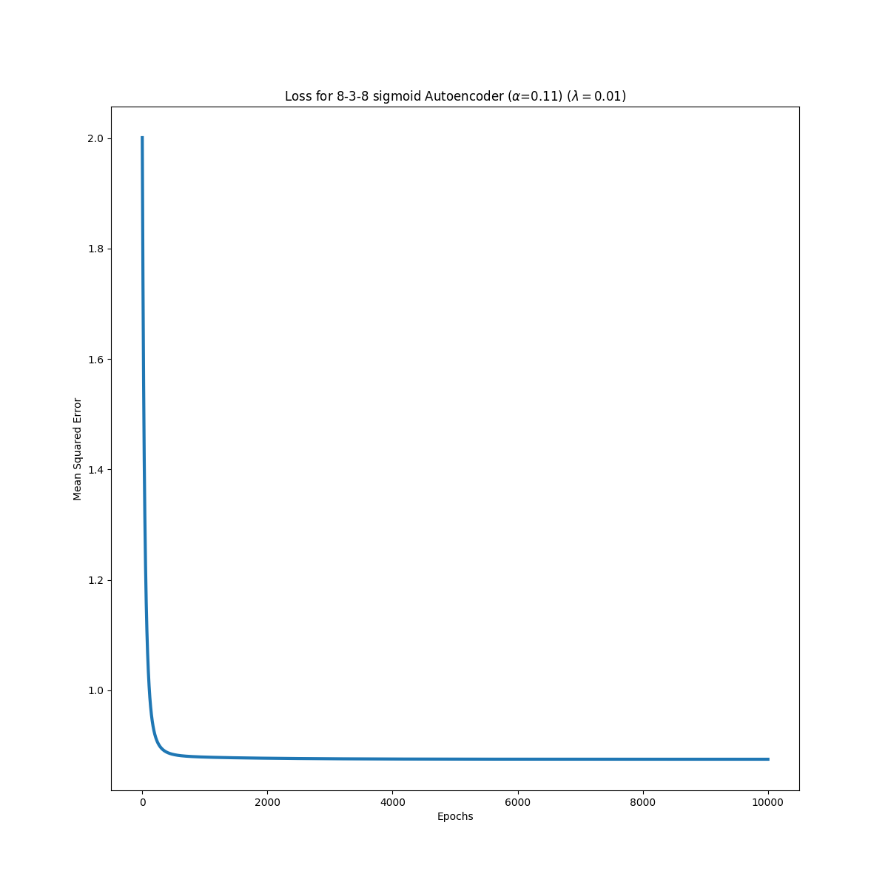
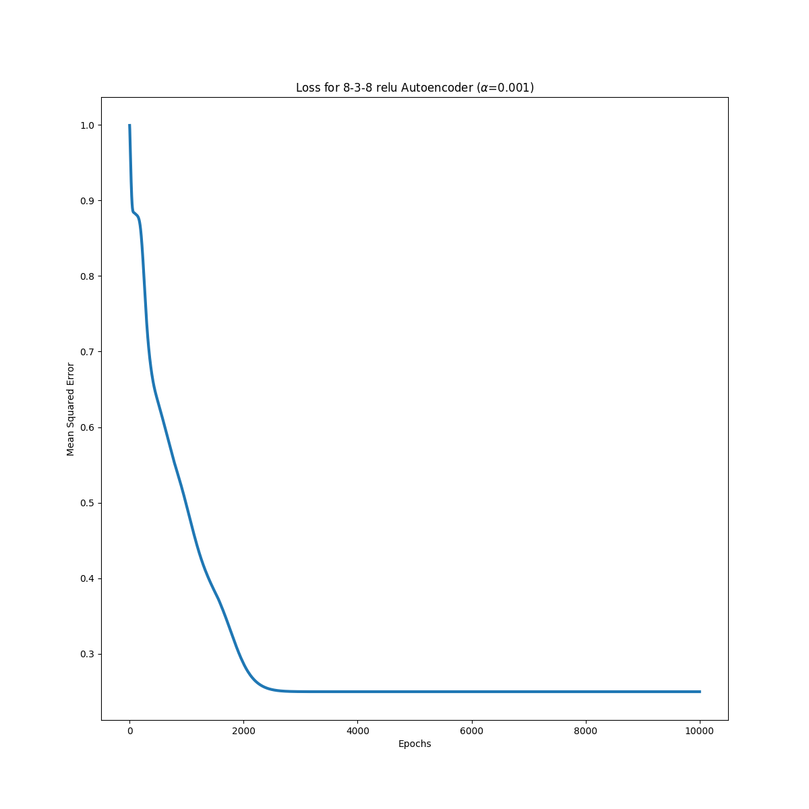
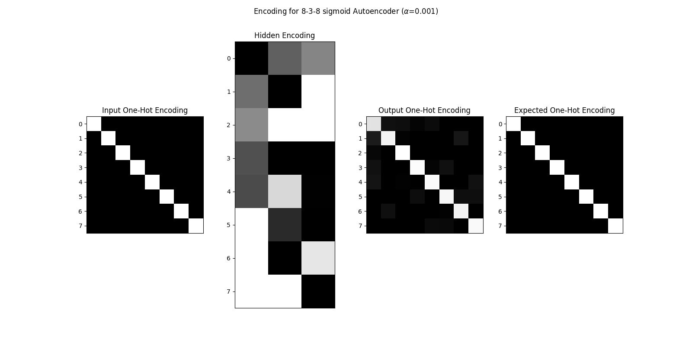
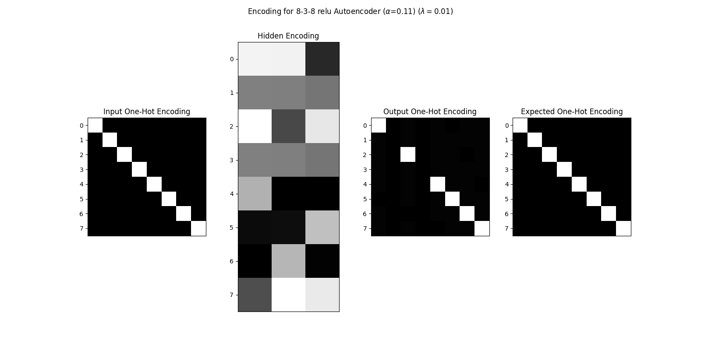
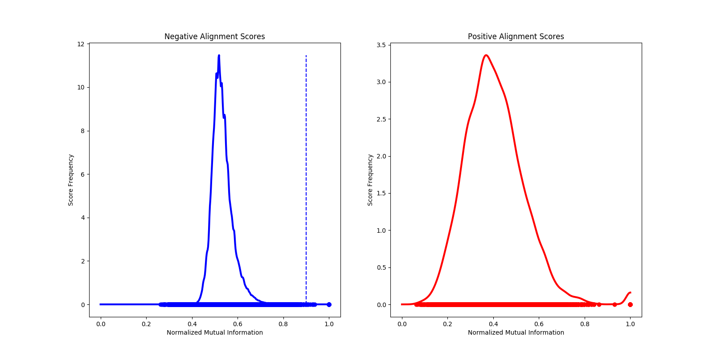
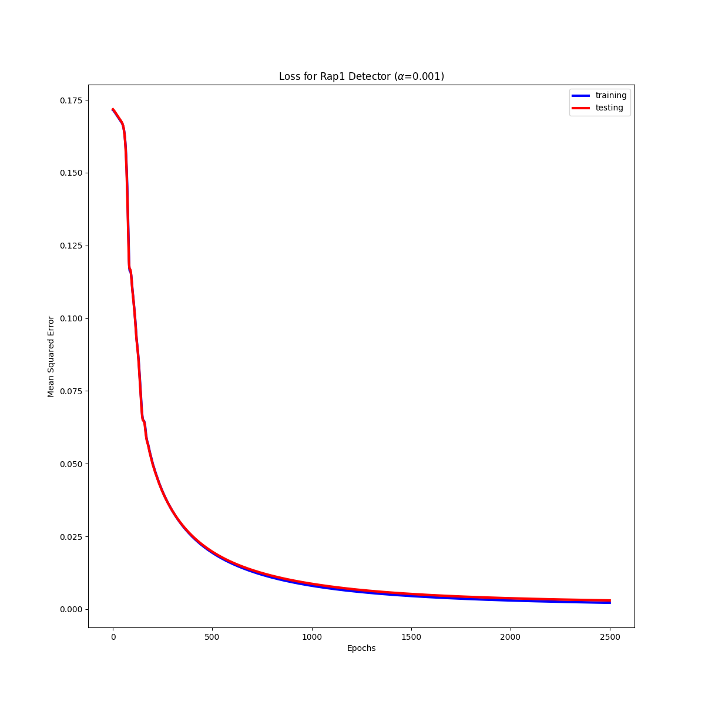
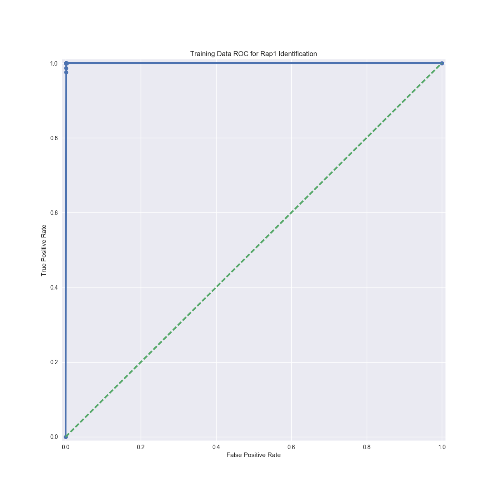
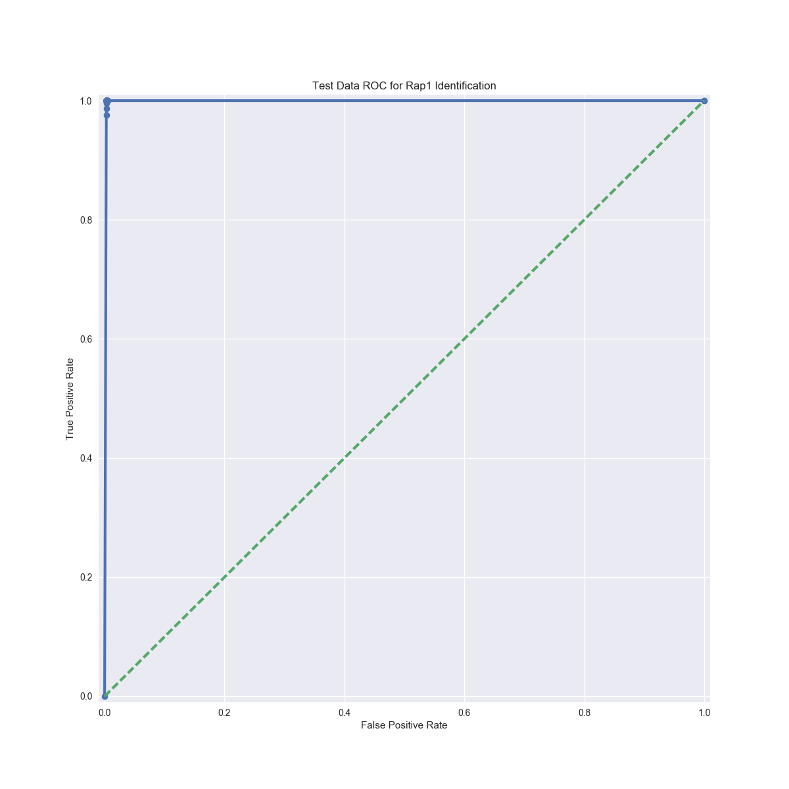
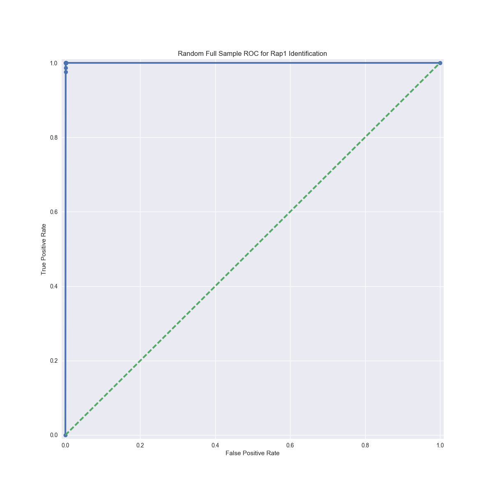

# BMI 203 - Final Project

[](https://travis-ci.org/david-joy/bmi203-final)

David Joy 3/24/2017<br/>

Final Project

## assignment

You are to construct a machine learning system that will distinguish real binding sites of a transcription factor (RAP1) from other sequences. The standard methodology for learning and representing TF binding sites is based on positive data (examples of known binding sites of a TF) alone. One generally constructs a linear position weight matrix based on the positive examples along with some model of the background probabilities of observing various sequences. There are limitations with this method, among them being that the linear model cannot address interdependencies among the different positions in the TF motif. There are cases where people have identified TF motifs where positional interdependencies exist. Interestingly, some of these cases are isomorphic to the XOR problem that killed perceptrons a few decades ago. Your work will address this problem as well as provide a way around the explicit requirement of a background model for sequence probabilities.

## 3-8-3 Autoencoder

Using the script in [train_838_autoenc.py](https://github.com/david-joy/bmi203-final/blob/master/train_838_autoenc.py), I built an autoencoder to try to encode 8 one-hot encoded labels into a 3 layer hidden unit net (to try to learn binary encoding). Using sigmoid activations gives the following loss profile:

<br />

And the following loss with ReLU:

<br />

With sigmoid functions, a fixed learning rate was unable to recover the code, but the [Adam](https://github.com/david-joy/bmi203-final/blob/master/final_project/optimizers.py#L48) optimizer was able to overcome the potential energy barrier and learn a perfect set of activations (although they don't completely correspond to standard binary code):

<br />

Replacing the sigmoid units with ReLUs learns a partially complete binary code, but suffers from dead neurons in the hidden layer that neither optimization strategy could overcome:

<br />

To replicate the ReLU training:<br />

```bash
python train_838_autoenc.py relu \
    --seed 1318744590 \
    --learn-rate 0.001 \
    --noise-magnitude 0.0 \
    --num-epochs 10000
```

To replicate the sigmoid training:

```bash
python train_838_autoenc.py sigmoid \
    --seed 1498790038 \
    --learn-rate 0.001 \
    --noise-magnitude 0.0 \
    --num-epochs 40000
```

Unlike some autoencoder tasks, adding noise to the inputs didn't seem to improve results.

## Rap1 Training Data

To find negative sequences that were a good match for the positive training set, I performed an ungapped alignment between the 137 positive examples and the ~3000 fragments from the yeast genome using the code in [_alignment.pyx](https://github.com/david-joy/bmi203-final/blob/master/final_project/_alignment.pyx) and calculated the top 5 normalized mutual information scores and sequences for each yeast fragment with the code in [make_rap1_data.py](https://github.com/david-joy/bmi203-final/blob/master/make_rap1_data.py). I also performed the same pairwise approach with the known positive fragments.

The fragments had the following distribution of scores:

<br />

Normalized mutual information between positive examples is a poor predictor of promotor identity, but it does manage to filter out the negative examples with very little sequence homology to any promoter site.

Interestingly, there were 81 negative fragements with > 90% similarity to a positive example. These examples were excluded from the training set as confounding data unlikely to be real negative examples.

To amplify the positive data set, all single point mutations of a Rap1 site were added to the training set as positive examples with a score of 0.8 (the original examples were given a score of 1.0). With 137 initial examples, this gives 137 * (3 * 17 + 1) = 7124 total positive examples.

An identical number of negative examples were drawn from the aligned dataset by drawing at random from the negative library weighted by the mutual information score of that sequence. This gave a total of ~14,000 samples, which were shuffled and then split into 90% training, 10% evaluation sets in `data/train_final.txt` and `data/test_final.txt`.

The data and plots were generated using [plot_rap1_data.py](https://github.com/david-joy/bmi203-final/blob/master/plot_rap1_data.py).

## Rap1 Detector

Using this training dataset a 4 layer neural network was designed:

- Input layer - 68 neurons (17 bases x 4 bits/base)
- Hidden layer 1 - 16 neurons
    - ReLU Activation
- Hidden layer 2 - 8 neurons
    - ReLU Activation
- Output layer - 1 neuron
    - Sigmoid Activation

This network accepts one-hot encoded 17-base motifs and outputs a value between 0 and 1 with 0 indicating not a Rap1 site and 1 indicating a Rap1 site with 100% confidence. The network was trained for 10000 iterations using [train_ann.py](https://github.com/david-joy/bmi203-final/blob/master/train_ann.py) resulting in the following loss profile:

<br />

This training can be replicated by calling:

```bash
python train_ann.py \
    --seed 333422904 \
    --learn-rate 0.001 \
    --num-epochs 10000
```

Training was stopped when the network reached minimal mean-squared error on the hold out test set (as measured by running for 1000 more iterations). Several other seeds were attempted, however some of them diverged, possibly due to floating point errors. A 0.1% error rate was deemed acceptable to continue analysis.

This same training program was attempted with networks omiting either of hidden layers 1, 2. Omitting hidden layer 1 caused the test error to diverge at 6000 iterations at 0.2% error. Omitting hidden layer 2 caused the test error to diverge around 3000 iterations at 0.3% error.

Several other architectures were attempted, adding a third hidden layer with 32 or 16 neurons and a ReLU activation before hidden layer 1. These architectures diverged before reaching 2000 iterations and never dropped below 0.5% test error.

Finally, the ReLU activations were systematically replaced with sigmoid activations. Sigmoid activation in hidden layer 1 reached 0.2% test error after 10000 iterations, but did not appear to have saturated. Sigmoid activation in hidden layer 2 diverged after 3000 iterations with a minimum error of 0.4%. Sigmoid activation in both hidden layers did eventually reach 0.1% test error, but took approximately 4x as long to train and evaluate.

These experiments indicate that the architecture outlined above is a good system to evaluate Rap1 binding sites given the training dataset.

## Evalutation

To verify that the network losses behaved as expected, the following ROC curves were constructed for training:

<br />

And test sets:

<br />

To evaluate performance on a less biased dataset, the a ROC curve was also calculated between the original positive dataset (without SNPS) and 1000 17-base kmers chosen at random from the upstream yeast dataset. A typical ROC curve from this experiment is given below:

<br />

All three plots give essentially perfect ROC plots, although the randomization approach is somewhat limited by the fact that it can only search 137 17-mers every iteration, which is small compared to the possible ~3.1 million 17-mers in the negative dataset.<br />

As a final test, the positive examples including SNPS were compared against the random sample dataset, giving the following typical ROC curve:

<br />

Again, the ROC curve is almost perfect, over several samplings. It's likely that the network has overfit the data to a fair extent, but with so few positive examples, it isn't particularly obvious how to combat this beyond the techniques already used.<br />

As a final verification, the two example sequences were tested against the network:

- The sample positive example "ACATCCGTGCACCATTT" scores 0.80263795
- The sample negative example "AAAAAAACGCAACTAAT" scores 0.00412595

These plots were generated with [plot_ann.py](https://github.com/david-joy/bmi203-final/blob/master/plot_ann.py)

## Predictions

The unlabeled test data was evaluated using [predict_ann.py](https://github.com/david-joy/bmi203-final/blob/master/predict_ann.py)

```bash
predict_ann.py \
    data/rap1-lieb-test.txt \
    data/rap1-lieb-pred.txt
```

The predicted scores for each sequence are in [rap1-lieb-pred.txt](https://github.com/david-joy/bmi203-final/blob/master/data/rap1-lieb-pred.txt). As a sanity check, a cutoff of 0.5 was used to verify the predictions contained both positive and negative indictations (as opposed to simply predicting all negative for example). Based on the sequences in the file:

- Predicting 1482 Positives
- Predicting 1713 Negatives

A roughly balanced set of predictions gives some confidence that the detector has at least learned something useful about Rap1 sites.

## Questions

1. How was your training regime designed so as to prevent the negative training data from overwhelming the positive training data? 

By focusing on training with negative examples that had strong sequence homology as measured by the mutual information criterion, the network quickly learned to distinguish the features that separate Rap1 sites from otherwise similar sites in the genome.

2. What was your stop criterion for convergence in your learned parameters? How did you decide this?

The stop criterion was chosen as the minimal error on the test set. Since training the network for too long caused the error to diverge, this limited the number of epochs for training to the values given above.

3. What set of learning parameters works the best? Please provide sample output from your system.

Altering the learning rate had drastic negative effects on training the system. With learning rates of 0.1 or 0.01, the system oscillated wildly around 50% error. A smaller learning rate was able to learn the task, but only achieved 3% test error after 10000 iterations.

Beta1 was less sensitive, and the optimizer converged to the same ~0.1% error for values of 0.7, 0.8, 0.9 over the same 10000 iterations (although values >0.9 had detrimental oscillatory effects).

Beta2 was very sensitive. Changing the value from the default of 0.999 to 0.99 improved the speed of convergence at first, but then resulted in oscilatory training and errors >30%. A smaller change to 0.998 converged to the same 0.1% test error after 10000 iterations.

Since the default parameters produced good results when training the 8-3-8 and most Rap1 detector nets, they were used to produce the final networks.

4. What are the effects of altering your system (e.g. number of hidden units or choice of kernel function)? Why do you think you observe these effects?

As the number of hidden units increases, the system gains more capability to memorize the dataset, which increases its performance on the training set (errors sometimes dropped nearly to 0) but causes it to overfit on the test set. Activation functions had a mild effect on performance compared to other machine learning tasks, but had a clear impact on the time to process the dataset.

5. What other parameters, if any, affect performance?

The choice of optimizer was key to training the network. The naive stochastic gradient descent algorithm was unable to train the simple 8-3-8 autoencoder, but the Adam optimizer was able to train most network architectures to very low error levels, with the exception of ReLU only networks which had a tendency to have dead neurons.

## structure

`model.py` contains the main neural network container class that assembles the layers found in `layers.py`. `optimizers.py` contains code to do various forms of adaptive stochastic gradient descent. `alignment.py` and the cython file `_alignment.pyx` contain the ungapped sequence alignment code. `io.py` contains tools to read the data files and write out scores. 

The `weights` folder contains the final weights for the networks described above. `ann_rap1.npz` contains the weights for the Rap1 detector. The two autoencoder files contain weights for the 8-3-8 autoencoder with ReLU and Sigmoid activation functions respectively.

The `models` folder contains the model descriptions for each of the networks described above, encoded as JSON dictionaries. They are named identically to the weight files. To reconstitute a network (e.g. the Rap1 detector):

```python
from final_project import model

net = model.load_model('model/ann_rap1.json')
net.load_weights('weights/ann_rap1.npz')
```

Key files in the folder layout:

```
.
├── README.md
├── data
├── plots
├── weights
│   ├── ann_rap1.npz
│   ├── autoencoder_838_relu.npz
│   └── autoencoder_838_sigmoid.npz
│   ...
├── final_project
│   ├── __init__.py
│   ├── model.py
│   ├── layers.py
│   ├── optimizers.py
│   ├── alignment.py
│   ├── _alignment.pyx
│   └── io.py
└── test
    ├── test_model.py
    ├── test_layers.py
    ├── test_alignment.py
    └── test_io.py
```

## usage

To use the package, first run

```
conda install --yes --file requirements.txt
```

to install all the dependencies in `requirements.txt`.

## testing

Testing is as simple as running

```
python -m pytest
```

from the root directory of this project.


## contributors

Original design by Scott Pegg. Refactored and updated by Tamas Nagy.
