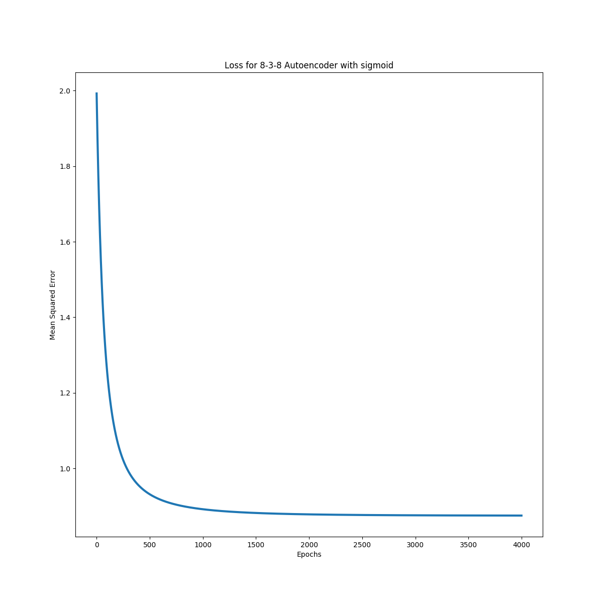
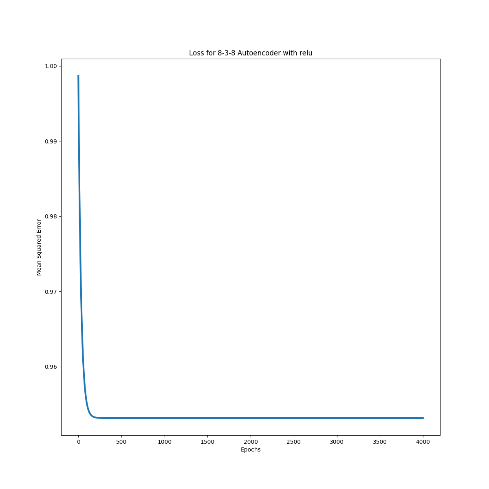

# BMI 203 - Final Project

[](https://travis-ci.org/david-joy/bmi203-final)

David Joy 3/24/2017<br/>

Final Project

## assignment

You are to construct a machine learning system that will distinguish real binding sites of a transcription factor (RAP1) from other sequences. The standard methodology for learning and representing TF binding sites is based on positive data (examples of known binding sites of a TF) alone. One generally constructs a linear position weight matrix based on the positive examples along with some model of the background probabilities of observing various sequences. There are limitations with this method, among them being that the linear model cannot address interdependencies among the different positions in the TF motif. There are cases where people have identified TF motifs where positional interdependencies exist. Interestingly, some of these cases are isomorphic to the XOR problem that killed perceptrons a few decades ago. Your work will address this problem as well as provide a way around the explicit requirement of a background model for sequence probabilities.

## 3-8-3 Autoencoder

Using the script in [train_838_autoenc.py](https://github.com/david-joy/bmi203-final/blob/master/train_838_autoenc.py), I built an autoencoder to try to encode 8 one-hot encoded labels into a 3 layer hidden unit net (to try to learn binary encoding). Training with learning rate of 0.0001 and weight decay of 0.0001 gives the following loss plot with sigmoid

<br />

And the following loss with ReLU:

<br />

## structure

`model.py` contains the main neural network container class that assembles the layers found in `layers.py`. `io.py` contains tools to read the data files and write out scores.

```
.
├── README.md
├── data
│   ...
├── final_project
│   ├── __init__.py
│   ├── model.py
│   ├── layers.py
│   └── io.py
└── test
    ├── test_model.py
    ├── test_layers.py
    └── test_io.py
```

## usage

To use the package, first run

```
conda install --yes --file requirements.txt
```

to install all the dependencies in `requirements.txt`. Then the package's
main function (located in `final_project/__main__.py`) can be run as
follows

```
python -m final_project -P data test.txt
```

## testing

Testing is as simple as running

```
python -m pytest
```

from the root directory of this project.


## contributors

Original design by Scott Pegg. Refactored and updated by Tamas Nagy.
