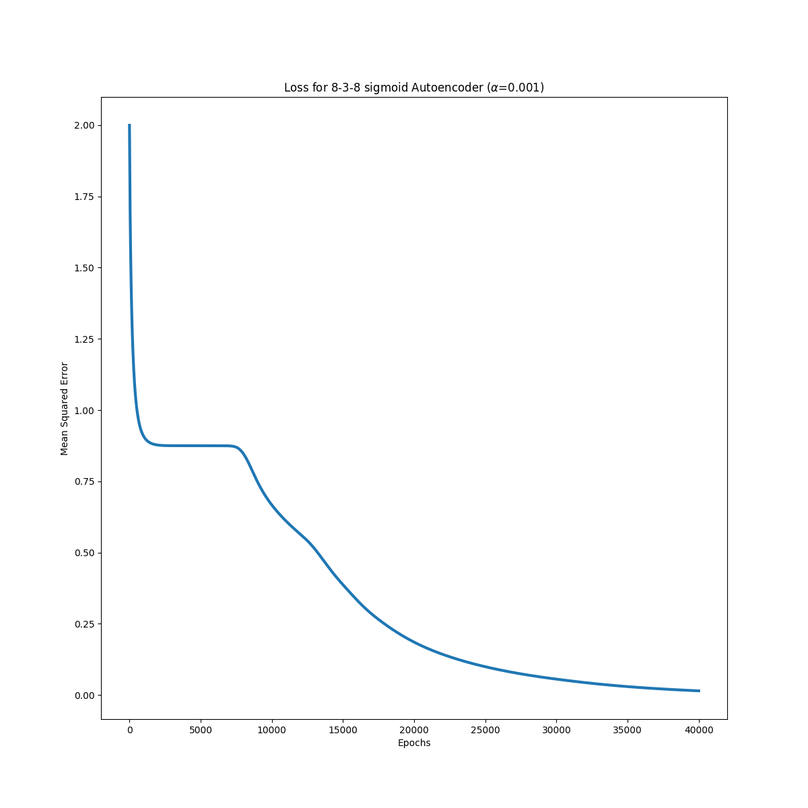
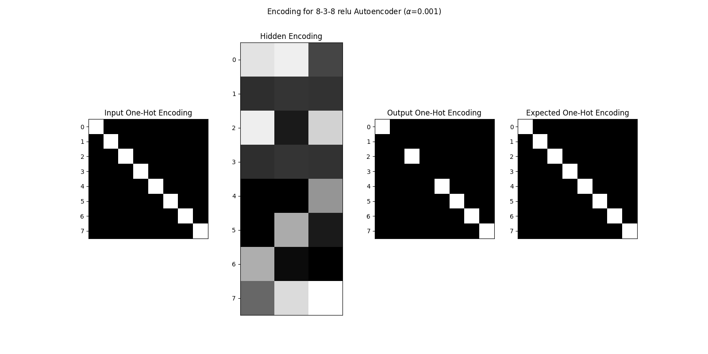
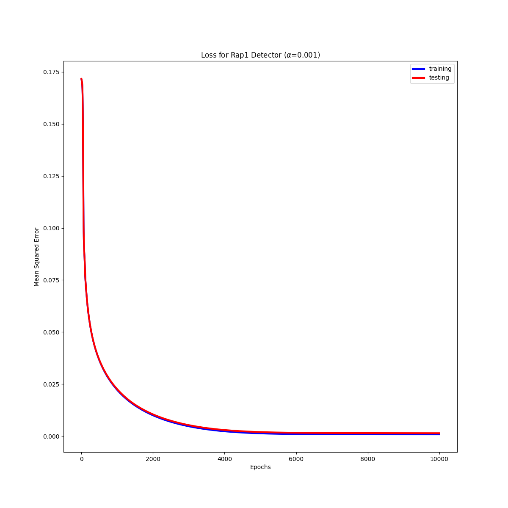

# BMI 203 - Final Project

[](https://travis-ci.org/david-joy/bmi203-final)

David Joy 3/24/2017<br/>

Final Project

## assignment

You are to construct a machine learning system that will distinguish real binding sites of a transcription factor (RAP1) from other sequences. The standard methodology for learning and representing TF binding sites is based on positive data (examples of known binding sites of a TF) alone. One generally constructs a linear position weight matrix based on the positive examples along with some model of the background probabilities of observing various sequences. There are limitations with this method, among them being that the linear model cannot address interdependencies among the different positions in the TF motif. There are cases where people have identified TF motifs where positional interdependencies exist. Interestingly, some of these cases are isomorphic to the XOR problem that killed perceptrons a few decades ago. Your work will address this problem as well as provide a way around the explicit requirement of a background model for sequence probabilities.

## 3-8-3 Autoencoder

Using the script in [train_838_autoenc.py](https://github.com/david-joy/bmi203-final/blob/master/train_838_autoenc.py), I built an autoencoder to try to encode 8 one-hot encoded labels into a 3 layer hidden unit net (to try to learn binary encoding). Using sigmoid activations gives the following loss profile:

<br />

And the following loss with ReLU:

<br />

With sigmoid functions, a fixed learning rate was unable to recover the code, but the [Adam](https://github.com/david-joy/bmi203-final/blob/master/final_project/optimizers.py#L48) optimizer was able to overcome the potential energy barrier and learn a perfect set of activations (although they don't completely correspond to standard binary code):

<br />

Replacing the sigmoid units with ReLUs learns a partially complete binary code, but suffers from dead neurons in the hidden layer that neither optimization strategy could overcome:

<br />

To replicate the ReLU training:<br />

```bash
python train_838_autoenc.py relu \
    --seed 1318744590 \
    --learn-rate 0.001 \
    --noise-magnitude 0.0 \
    --num-epochs 10000
```

To replicate the sigmoid training:

```bash
python train_838_autoenc.py sigmoid \
    --seed 1498790038 \
    --learn-rate 0.001 \
    --noise-magnitude 0.0 \
    --num-epochs 40000
```

Unlike some autoencoder tasks, adding noise to the inputs didn't seem to improve results.

## Rap1 Training Data

To find negative sequences that were a good match for the positive training set, I performed an ungapped alignment between the 137 positive examples and the ~3000 fragments from the yeast genome using the code in [_alignment.pyx](https://github.com/david-joy/bmi203-final/blob/master/final_project/_alignment.pyx) and calculated the top 5 normalized mutual information scores and sequences for each yeast fragment with the code in [make_rap1_data.py](https://github.com/david-joy/bmi203-final/blob/master/make_rap1_data.py). I also performed the same pairwise approach with the known positive fragments.

The fragments had the following distribution of scores:

<br />

Normalized mutual information between positive examples is a poor predictor of promotor identity, but it does manage to filter out the negative examples with very little sequence homology to any promoter site.

Interestingly, there were 81 negative fragements with > 90% similarity to a positive example. These examples were excluded from the training set as confounding data unlikely to be real negative examples.

To amplify the positive data set, all single point mutations of a Rap1 site were added to the training set as positive examples with a score of 0.8 (the original examples were given a score of 1.0). With 137 initial examples, this gives 137 * (3 * 17 + 1) = 7124 total positive examples.

An identical number of negative examples were drawn from the aligned dataset by drawing at random from the negative library weighted by the mutual information score of that sequence. This gave a total of ~14,000 samples, which were shuffled and then split into 90% training, 10% evaluation sets in `data/train_final.txt` and `data/test_final.txt`.

The data and plots were generated using [plot_rap1_data.py](https://github.com/david-joy/bmi203-final/blob/master/plot_rap1_data.py).

## Rap1 Detector

Using this training dataset a 5 layer neural network was designed:

- Input layer - 68 neurons (17 bases x 4 bits/base)
    - ReLU Activation
- Hidden layer 1 - 32 neurons
    - ReLU Activation
- Hidden layer 2 - 16 neurons
    - ReLU Activation
- Hidden layer 3 - 8 neurons
    - Sigmoid Activation
- Output layer - 1 neuron

This network accepts one-hot encoded 17-base motifs and outputs a value between 0 and 1 with 0 indicating not a Rap1 site and 1 indicating a Rap1 site with 100% confidence. The network was trained for 2500 iterations using [train_ann.py](https://github.com/david-joy/bmi203-final/blob/master/train_ann.py) resulting in the following loss profile:

<br />

This training can be replicated by calling:

```bash
python train_ann.py \
    --seed 2426914260 \
    --learn-rate 0.001 \
    --num-epochs 2500
```

Training was stopped when the network reached 3% MSE on the hold out test data. It was attempted to train further, but the network error diverged due to dead neurons in the hidden layers.

This same training program was attempted with networks omiting either of hidden layers 1, 2, or 3.

## Questions

1. How was your training regime designed so as to prevent the negative training data from overwhelming the positive training data? 

By focusing on training with negative examples that had strong sequence homology as measured by the mutual information criterion, the network quickly learned to distinguish the features that separate Rap1 sites from otherwise similar sites in the genome.

2. What was your stop criterion for convergence in your learned parameters? How did you decide this?

The stop criterion was chosen as the minimal error on the test set. Since training the network for too long caused the error to diverge, this limited the number of epochs for training to the values given above.

## structure

`model.py` contains the main neural network container class that assembles the layers found in `layers.py`. `optimizers.py` contains code to do various forms of adaptive stochastic gradient descent. `alignment.py` and the cython file `_alignment.pyx` contain the ungapped sequence alignment code. `io.py` contains tools to read the data files and write out scores. 

```
.
├── README.md
├── data
│   ...
├── final_project
│   ├── __init__.py
│   ├── model.py
│   ├── layers.py
│   ├── optimizers.py
│   ├── alignment.py
│   ├── _alignment.pyx
│   └── io.py
└── test
    ├── test_model.py
    ├── test_layers.py
    ├── test_alignment.py
    └── test_io.py
```

## usage

To use the package, first run

```
conda install --yes --file requirements.txt
```

to install all the dependencies in `requirements.txt`.

## testing

Testing is as simple as running

```
python -m pytest
```

from the root directory of this project.


## contributors

Original design by Scott Pegg. Refactored and updated by Tamas Nagy.
